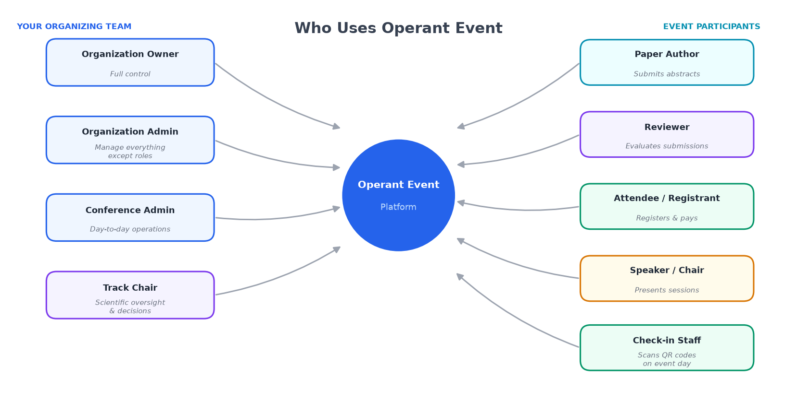
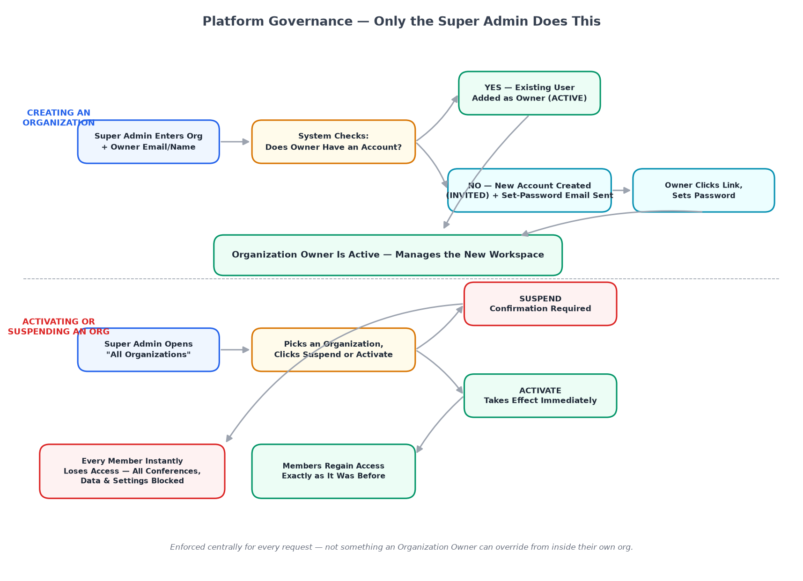
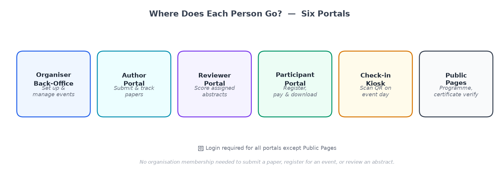
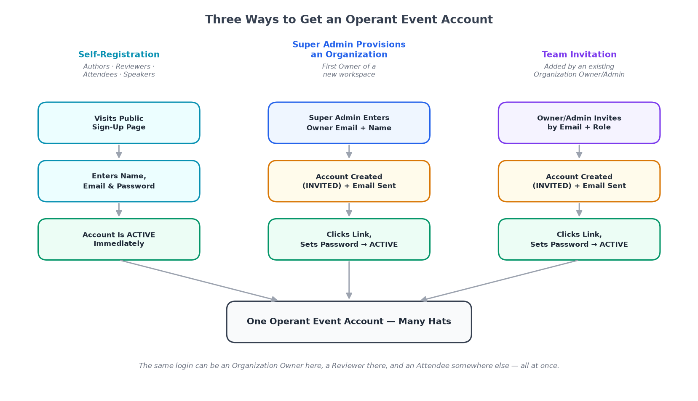
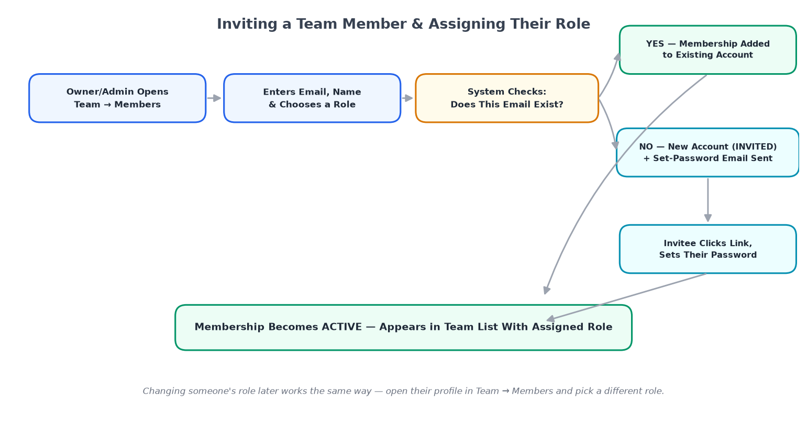
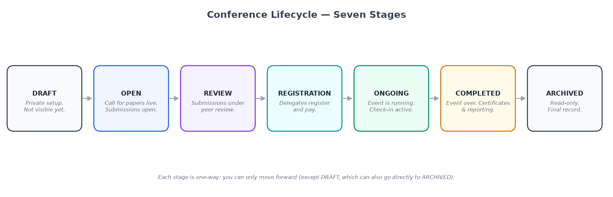
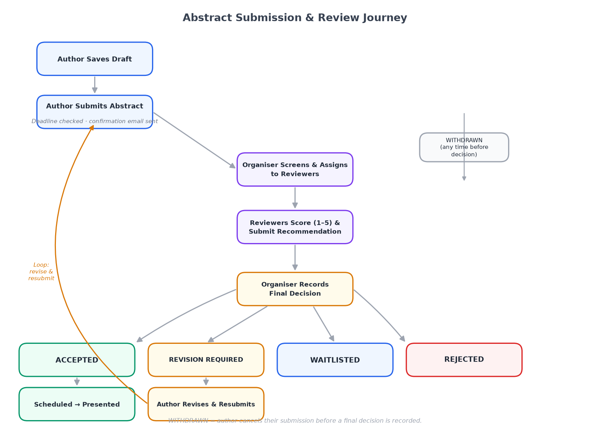
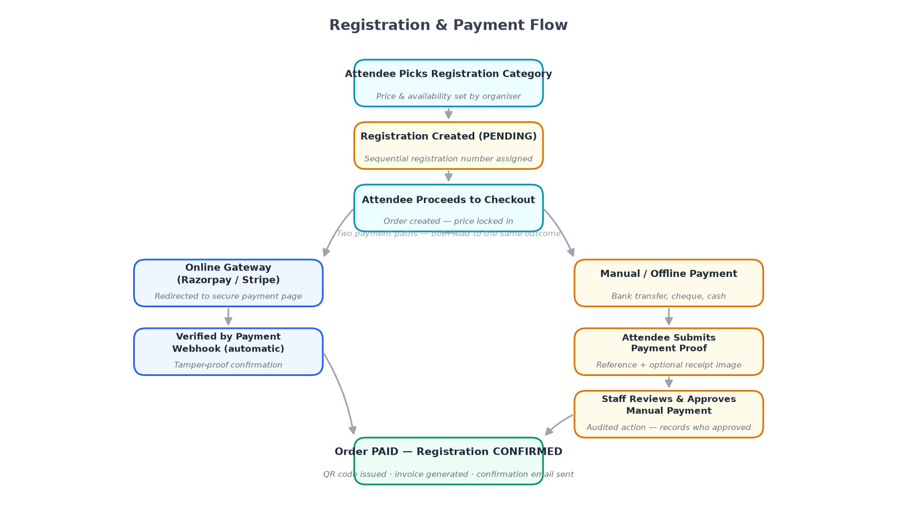
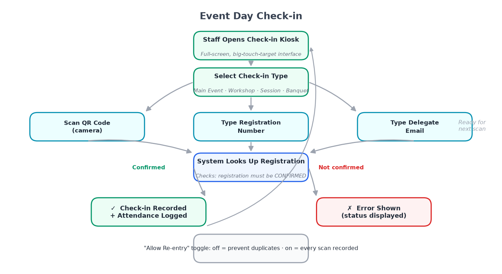
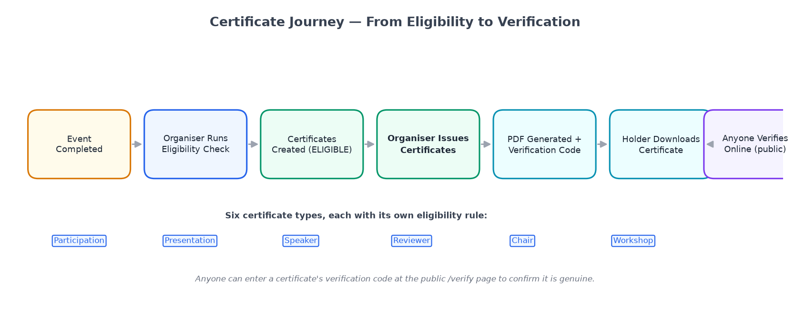

# Operant Event

## Complete User Guide

### A Plain-English Guide to Running Conferences, Managing Papers, Reviews, Registrations, and More

---

**Version:** 1.0
**Prepared:** September 2026
**Audience:** Organizers, Reviewers, Authors, Attendees, Speakers, and Event Staff
**Reading time:** Approximately 45–60 minutes (or use the Table of Contents to jump to any topic)

---

## Table of Contents

1. [Welcome to Operant Event](#1-welcome-to-operant-event)
2. [Who Uses This Application](#2-who-uses-this-application)
3. [Where Do You Log In? The Six Portals](#3-where-do-you-log-in-the-six-portals)
4. [Getting Started: Creating Your Account](#4-getting-started-creating-your-account)
5. [Your Organization: The Workspace Behind Every Event](#5-your-organization-the-workspace-behind-every-event)
6. [Managing Your Team: Members, Roles & Permissions](#6-managing-your-team-members-roles--permissions)
7. [Conferences: The Life of an Event](#7-conferences-the-life-of-an-event)
8. [Setting Up a New Conference](#8-setting-up-a-new-conference)
9. [Tracks and the Submission Form Builder](#9-tracks-and-the-submission-form-builder)
10. [Submitting a Paper: The Author's Journey](#10-submitting-a-paper-the-authors-journey)
11. [The Peer Review Process](#11-the-peer-review-process)
12. [Registration and Payments](#12-registration-and-payments)
13. [Building the Conference Programme](#13-building-the-conference-programme)
14. [Event Day: Checking In Delegates](#14-event-day-checking-in-delegates)
15. [Certificates](#15-certificates)
16. [Sponsors and Exhibitors](#16-sponsors-and-exhibitors)
17. [Notifications and Automated Emails](#17-notifications-and-automated-emails)
18. [Reports and Dashboards](#18-reports-and-dashboards)
19. [Exporting and Importing Data](#19-exporting-and-importing-data)
20. [Your Account and Security](#20-your-account-and-security)
21. [Roles and Permissions Reference](#21-roles-and-permissions-reference)
22. [What This Application Does Not Do Yet](#22-what-this-application-does-not-do-yet)
23. [Frequently Asked Questions](#23-frequently-asked-questions)
24. [Glossary of Terms](#24-glossary-of-terms)

---

## 1. Welcome to Operant Event

Operant Event is a complete, all-in-one platform for planning and running conferences, seminars, and academic or professional events — from the very first announcement to handing out certificates after the closing ceremony.

Think of it as the digital "control room" for your event. Instead of juggling spreadsheets for paper submissions, a separate tool for collecting registration fees, a mailing list for reminders, and a printed sign-in sheet at the door, everything lives in one connected system:

- Researchers and speakers **submit their papers or abstracts** online and track their status.
- Your review committee **evaluates submissions** and records decisions — accept, reject, request changes, or waitlist.
- Delegates **register and pay** online, and instantly receive a personal QR code.
- Your team **builds the day-by-day programme**, assigning speakers and sessions.
- On the big day, staff **check people in with a quick scan** at the door.
- After the event, the system **automatically works out who has earned a certificate** and lets you issue them with one click.
- Throughout, everyone receives **automatic email updates** at the right moments — no one has to remember to send them.

One organization can run as many conferences as it likes, and each conference moves through the same clear, predictable stages, described in detail in [Section 7](#7-conferences-the-life-of-an-event).

This guide is written for **everyone who touches the system** — not just the people setting it up. Whether you're an event organizer, a committee member reviewing papers, an author submitting your research, a delegate registering to attend, or a volunteer scanning badges at the entrance, this guide has a section written for you.

> **How to use this guide:** You don't need to read it front to back. Use the Table of Contents above to jump straight to the section that matches what you're trying to do right now.

---

## 2. Who Uses This Application

Operant Event is built around two broad groups of people: the **team that organizes the event**, and the **people who take part in it**. Nobody needs special software or training — everything happens through a normal web browser.

### Platform Super Admin

Before any organizing team can exist, the platform itself needs to be set up by a **Platform Super Admin**. This is a special account held by whoever operates the Operant Event platform for your organization (typically your IT team or service provider). The Super Admin sits above all organizations and has two exclusive jobs: **creating new organizations** on the platform (designating each one's first owner), and **overseeing every organization that exists** — including the ability to suspend one.

| Role | In plain terms |
|---|---|
| **Platform Super Admin** | The platform operator. Creates new organizations (workspaces) and provisions their first Organization Owner. Can see every organization on the platform in one list and suspend or reactivate any of them. Does not participate in the day-to-day running of any individual conference. There is only one Super Admin account per platform deployment. |

> **If you're setting up a new organization:** You don't self-register as an owner. Instead, ask the person who runs the Operant Event platform for your institution (your IT team or platform administrator) to provision a new organization for you. They will create it and send you an invitation email to set your password and take ownership of your new workspace.

### Suspending or Reactivating an Organization

From the **All Organizations** screen, the Super Admin can see every organization on the platform at a glance — its name, how many members it has, and whether it's currently Active or Suspended. Two things can happen there:

- **Suspend** — immediately blocks every member of that organization from everything: conferences, abstracts, registrations, payments, reports, settings. Nobody inside that organization can override this, no matter what role they hold. Because the effect is immediate and wide-reaching, the Super Admin must confirm the action before it takes effect.
- **Activate** — immediately restores access exactly as it was before the suspension. No data is lost while an organization is suspended; everything simply becomes read-and-write-accessible again.

This is typically used for billing issues, policy violations, or while an account dispute is being resolved — it is a platform-level safety switch, not something that happens as part of normal day-to-day use.

### Your Organizing Team

Once an organization has been created, *these* are the people inside your organization (your society, university, or event company) who plan and run the show. They log in to a shared organizer back-office and see only the conferences that belong to their organization.

| Role | In plain terms |
|---|---|
| **Organization Owner** | The person designated as the first owner when the workspace was created, or someone later promoted to full control. Can do absolutely everything within the organization, including deciding who else gets which powers. Every organization has at least one. |
| **Organization Admin** | Almost as powerful as the Owner — can manage every part of every conference and the whole team — except they cannot hand out roles or change who has ownership-level control. |
| **Conference Admin** | The day-to-day event manager. Runs registration, payments, the programme, check-in, certificates, sponsors, and reporting for the conferences they're assigned to. Does not handle the academic review side. |
| **Track Chair** | The academic/scientific lead. Manages the reviewer pool, assigns papers to reviewers, and makes the final accept/reject decisions. Does not handle money or logistics. |

Your organization isn't limited to these four labels — an Owner can also create **custom roles** by picking and choosing exactly which capabilities a new role should have (see [Section 6](#6-managing-your-team-members-roles--permissions)).

### Everyone Who Takes Part in Your Event

These people never need to be added to your organization's team. They simply create a free personal account (or are invited to one), and the system automatically gives them exactly the right screens for what they're doing.

| Who they are | What they do in the system |
|---|---|
| **Author / Submitter** | Anyone who wants to submit a paper, abstract, or proposal to one of your conferences. |
| **Reviewer** | A subject-matter expert your Track Chair has added to the reviewer pool. Evaluates the papers assigned to them. A person can review for several different organizations at once. |
| **Attendee / Registrant** | Anyone who registers to attend, pays the applicable fee, and later checks in on the day. |
| **Speaker / Session Chair** | People who present, chair, or co-chair a session — added to the programme by your team, and optionally linked to their own personal account so they can download a speaker certificate. |
| **Check-in Staff** | Anyone on your team given check-in permission — they use a purpose-built scanning screen on event day, usually on a tablet or laptop at the registration desk. |
| **Exhibitor / Sponsor contact** | Companies and organizations supporting your event. Today, these are tracked as records by your team (booth number, tier, payment status) — they do not log in themselves. |

---

## 3. Where Do You Log In? The Six Portals

Operant Event shows a different, purpose-built screen depending on who you are and what you're doing — so a delegate never has to wade through organizer settings just to download their ticket, and an author never sees a reviewer's scoring form by mistake.

| Portal | Who uses it | What it's for |
|---|---|---|
| **Organizer Back-Office** | Your organizing team | Setting up and running conferences: settings, abstracts, reviewers, registration, payments, programme, check-in, certificates, sponsors, exhibitors, reports |
| **Author Portal** | Anyone submitting a paper | The submission wizard and a simple list of "My Abstracts" |
| **Reviewer Portal** | Reviewers | "My Reviews" — a list of assignments and the scoring form |
| **Participant Portal** | Attendees / delegates | Choosing a registration category, paying, viewing tickets and certificates |
| **Check-in Kiosk** | Registration desk staff | A full-screen scanning station for event-day check-in |
| **Public Pages** | Anyone, no account needed | Signing in, creating an account, the public event programme, and certificate verification |

A single person can move between several of these without any extra effort — for example, someone who is both a conference organizer *and* a paper reviewer simply switches to whichever list ("My Reviews" or the organizer dashboard) matches what they're doing.

## 4. Getting Started: Creating Your Account

Most people — authors, reviewers, attendees, and organizing team members — create a personal account through the public sign-up page. Organization workspaces are set up separately by the Platform Super Admin (see [Section 2](#2-who-uses-this-application)).

**Creating a personal account (for authors, reviewers, attendees, and most organizers):**

1. **Go to the sign-up page.** Your organization will share a link, or you may arrive there automatically after clicking "Register" on a conference's public page.
2. **Enter your name, email address, and a password.** Passwords must be reasonably strong; the system will tell you immediately if yours is too weak.
3. **Check your inbox.** You'll receive a welcome email confirming your account is active.
4. **Sign in.** From now on, this one login works everywhere in Operant Event — as an author, a reviewer, a delegate, or (if invited) as part of an organizing team.

**If you are the designated owner of a new organization:** You will receive a special invitation email from the Platform Super Admin when they create your organization. Clicking the link in that email lets you set your password and immediately gives you full Organization Owner access to your new workspace — no separate sign-up step needed.

**If you were invited to join an existing organization's team:** You'll receive an email invitation with a special link. Clicking it lets you set your password and immediately drops you into the organizer back-office with whatever role you were invited to hold.

**Forgotten your password?** Use the "Forgot password" link on the sign-in page. You'll get a reset email with a secure, time-limited link — for your protection, it only works for a short window and only once.

**One account, many hats.** Because your login is personal (not tied to one conference or one role), the exact same email address and password can be an Organization Owner for your own society's conferences, a Reviewer for a completely different conference run by another organization, and an Attendee registering for a third. The system quietly keeps all of this straight in the background.

---

## 5. Your Organization: The Workspace Behind Every Event

An **Organization** is the umbrella workspace for everything your society, university department, or event company does in Operant Event. Every conference belongs to exactly one organization, and every organizer belongs to at least one.

### Creating an Organization

Organizations are created by the **Platform Super Admin** — the person or team responsible for operating the Operant Event platform. The Super Admin fills in the organization's basic details (name, a short "slug" used in web addresses, and contact information), and specifies who the first **Organization Owner** should be. If that person does not yet have an account, the system creates one automatically and sends them a set-password email so they can log in and take ownership immediately.

**In short: you cannot self-create an organization.** If you need a new workspace provisioned, contact your platform administrator.

### What Lives Inside an Organization

- **Every conference** you've ever run or are currently planning, all visible in one dashboard.
- **Your whole team** — everyone with organizer-side access, and the role each of them holds.
- **Organization-wide settings** — branding, default email sender address, and payment gateway connections that can be shared across conferences.
- **Cross-conference reporting** — see totals and trends across every event you run, not just one at a time.

### Multiple Organizations

There is nothing stopping one person from belonging to more than one organization. A freelance conference manager, for instance, might be an Organization Admin for two different professional societies. When they log in, they simply pick which organization's workspace to work in; each one's data, team, and conferences stay completely separate from the other.

---

## 6. Managing Your Team: Members, Roles & Permissions

As your organization grows, you'll want colleagues to help run things — without necessarily giving every one of them full control.

### Inviting a Team Member

1. From the organizer back-office, open **Team → Members**.
2. Click **Invite Member**, enter their email address, and choose the role they should hold.
3. They receive an email invitation. Once accepted, they appear in your member list with that role attached.

### Changing Someone's Role

Owners and Admins can open any member's profile and change their role at any time — for example, promoting a helpful Conference Admin to Organization Admin, or narrowing someone's access after an event wraps up.

### Removing a Team Member

When someone leaves your team, remove them from **Team → Members**. Their personal account still exists (they can still log in as, say, an attendee elsewhere), but they immediately lose all access to your organization's conferences and data.

### Built-in Roles vs. Custom Roles

Operant Event ships with four ready-made roles — **Organization Owner, Organization Admin, Conference Admin,** and **Track Chair** — described in [Section 2](#2-who-uses-this-application). For most organizations, these four are all you'll ever need.

If your organization has an unusual need — say, a "Finance Officer" who should see payment reports but nothing else — an Owner can build a **custom role** by selecting exactly which individual permissions (capabilities) it should carry from the full permission catalogue, then assign that custom role to a team member just like any built-in one. See the complete list of individual permissions in [Section 21](#21-roles-and-permissions-reference).

### Per-Conference Assignment

Some roles — Conference Admin and Track Chair — are typically assigned **per conference**, not organization-wide. This means one person can be the Conference Admin for "Annual Meeting 2027" while someone else entirely manages "Regional Workshop 2027," even though both conferences belong to the same organization.

---

## 7. Conferences: The Life of an Event

Every conference your organization runs moves through the same series of clear stages, from a first idea to a wrapped-up archive. Understanding these stages helps you know what's possible — and what to expect — at any given moment.

| Stage | What's happening |
|---|---|
| **Draft** | The conference exists only as a private idea. You're filling in basic details — name, dates, venue — and nothing is visible to the outside world yet. |
| **Published** | The conference has a public page. Depending on what you've turned on, people may already be able to submit abstracts or begin registering. |
| **Submissions Open** | Authors can submit papers/abstracts to your tracks. You control the exact opening and closing dates. |
| **Under Review** | Submissions have closed and your reviewers and Track Chair are evaluating them. |
| **Programme Building** | Decisions are in, and your team is assembling the day-by-day schedule of sessions, speakers, and rooms. |
| **Live / Ongoing** | The event itself is happening. Check-in is active, and the programme is what attendees see and follow. |
| **Completed / Archived** | The event has ended. Certificates can now be issued, and final reports are available. The conference record remains for your history, exports, and reference. |

You don't have to use every stage for every conference — a simple one-day workshop with no formal papers might skip straight from Draft to Live, while a full multi-track academic conference will use every stage in order. Your Conference Admin decides which features (abstracts, payments, certificates, etc.) are switched on for each individual conference.

---

## 8. Setting Up a New Conference

Creating a conference is a guided, step-by-step process. You can always come back and adjust any of these later — nothing here is permanent on day one.

1. **Basic details** — name, short description, start and end dates, time zone, and venue (physical address, fully online, or hybrid).
2. **Branding** — upload a logo and choose accent colours so the public pages and emails feel like *your* event, not a generic template.
3. **Feature toggles** — turn on only what this particular conference needs: Abstract Submissions, Peer Review, Paid Registration, Certificates, Sponsors. A simple meetup might only need Paid Registration turned on.
4. **Tracks** (if abstracts are enabled) — create one or more subject tracks authors can submit to; see [Section 9](#9-tracks-and-the-submission-form-builder).
5. **Registration categories** (if registration is enabled) — define who can register and at what price; see [Section 12](#12-registration-and-payments).
6. **Publish** — when you're ready, move the conference from Draft to Published so the outside world can see its public page.

**Cloning a conference:** Running the same annual event year after year? Rather than rebuild it from scratch, you can duplicate a previous conference — carrying over its tracks, form fields, and registration categories — and simply update the dates, then adjust anything that changed.

## 9. Tracks and the Submission Form Builder

A **Track** is a subject area or theme that authors submit to. "Machine Learning," "Healthcare Policy," and "Poster Presentations" are all examples of tracks in a multi-track academic conference.

### Creating Tracks

In the organizer back-office, open your conference and go to **Tracks → Add Track**. Give it a name and, optionally, a short description of what it covers. You can create as many tracks as you like.

### Assigning a Track Chair

Each track should have a **Track Chair** — the person responsible for recruiting reviewers and making final accept/reject decisions for that topic area. Simply type their email address in the Track Chair field; if they already have an Operant Event account, they're linked instantly. If not, they'll receive an invitation to create one.

### The Submission Form Builder

Every track has its own **custom submission form** — you decide exactly what you want authors to tell you. The form builder offers a library of field types:

| Field type | What it collects |
|---|---|
| **Short text** | One-line answers: a title, an author name, an affiliation |
| **Long text / rich text** | Multi-paragraph text with optional formatting; ideal for an abstract body |
| **Dropdown** | Choose from a fixed list you define; e.g. "Presentation format: Full Paper / Short Paper / Poster" |
| **Checkboxes** | Let authors tick one or more items from a list |
| **File upload** | Accept a PDF, DOCX, or other file — for authors submitting the full paper alongside the abstract |
| **Date picker** | A calendar selector |
| **Author/co-author block** | A repeating group that collects first name, last name, affiliation, email, and ORCID for each author on the paper |

You can drag fields to reorder them, mark any field as required, add help text underneath, and hide or show fields conditionally (e.g. "Show the 'Camera-ready deadline' note only if Presentation format is Full Paper").

> **Tip:** The Track Chair can update a track's reviewer assignments and form at any time before submissions close, but changing a form after authors have already submitted will not retroactively alter existing submissions — plan your form before opening.

---

## 10. Submitting a Paper: The Author's Journey

If you're an author or researcher submitting a paper to a conference, this section is written for you.

### Step 1 — Find the Conference and Track

The organization will share a direct link to their conference's submission page, or you may find it through a public events directory. Select the track you're submitting to — for example, "Track B: Sustainability and Green Computing" — and click **Submit to this track**.

### Step 2 — Create or Sign In to Your Account

If you don't have an Operant Event account yet, you'll be prompted to create one (name, email, password). If you do, simply sign in. Your account is free and takes less than a minute to create.

### Step 3 — Fill In the Submission Form

Work through the form the Track Chair has designed. Every field marked with an asterisk (*) is required. A few things to know:

- **Saving your draft:** Click **Save Draft** at any time — you can come back and continue later from the same browser or a different device. Your draft is saved privately; the Track Chair cannot see it until you actually submit.
- **Author list:** Most forms include a section to add co-authors. You'll need each co-author's full name, email, and affiliation. They don't need their own Operant Event account for their name to appear on the submission, though they may receive a notification email.
- **File uploads:** If the form asks for a PDF, make sure your file is under the maximum size shown on screen (usually 10 MB). Only the file types listed are accepted.

### Step 4 — Submit

When everything is complete, click **Submit**. You'll see a summary page confirming everything was received, and you'll get an email confirmation straight away. Keep this email — it's your record that the submission arrived before the deadline.

### Step 5 — Track Your Submission

Sign in to your account at any time after submitting and go to **My Submissions**. You'll see every abstract or paper you've ever submitted across any conference on the platform, together with its current status:

| Status shown | What it means |
|---|---|
| **Submitted** | Your paper arrived and is in the queue to be assigned to a reviewer. |
| **Under Review** | Reviewers are currently reading and scoring your work. |
| **Revision Requested** | The Track Chair has asked you to make changes before a final decision. See below. |
| **Accepted** | Congratulations — your paper has been accepted for the conference. |
| **Waitlisted** | Your paper may still be included if space allows after all decisions are made. |
| **Rejected** | Your paper was not accepted for this submission round. The Track Chair may or may not include written reviewer feedback, depending on conference policy. |
| **Withdrawn** | You withdrew the submission yourself. |

### Revisions: When the Track Chair Asks for Changes

If your status changes to **Revision Requested**, you'll receive an email from the system (and optionally a personal note from the Track Chair). Sign in, open that submission, read the reviewers' comments, make your changes, and click **Re-submit**. The Track Chair and reviewers then look at the updated version.

### Withdrawing a Submission

If you decide not to proceed, open the submission in **My Submissions** and click **Withdraw**. You can include a brief note if you like. Once withdrawn, the submission is removed from the review queue. You cannot un-withdraw — if you change your mind and wish to submit again, you'll need to start a new submission (subject to the deadline still being open).

---

## 11. The Peer Review Process

This section explains what happens to a submission once it arrives — first from the organizer's perspective, then from a reviewer's.

### For the Organizing Team (Track Chair / Conference Admin)

Once the submission window closes, the Track Chair takes over.

**Step 1 — Build the Reviewer Pool**

Go to your conference, select the relevant track, and open **Reviewers → Add Reviewers**. You can add people by email address. If they already have an account, they're in immediately; if not, they receive an invitation and appear in the pool once they accept. You can add as many reviewers as you need — there is no limit.

**Step 2 — Assign Papers to Reviewers**

Go to **Assignments**. You can:
- **Auto-assign** — let the system distribute papers across the reviewer pool evenly.
- **Manual assign** — pick which reviewer gets which paper, useful when you have specific expertise matching in mind.

A reviewer can have more than one paper assigned to them, and a paper can have more than one reviewer. Most conferences ask for two or three independent reviews of each paper for fairness.

**Step 3 — Monitor Progress**

The **Assignments dashboard** shows you at a glance how many papers each reviewer has completed, how many are pending, and whether any are overdue. You can send a nudge reminder to reviewers from this screen without having to email them separately.

**Step 4 — Record the Final Decision**

Once reviews are in for a paper, the Track Chair looks at all the scores and feedback, then records a decision: **Accept, Reject, Revision, or Waitlist**. Authors are notified automatically the moment a decision is recorded. The Track Chair can also write a personal note to the authors that accompanies the automated email.

---

### For Reviewers

If you've been invited to review papers for a conference, here is your experience:

1. **Accept the invitation.** You'll receive an email with a link. Click it to accept. You can decline if you have a conflict of interest with any assigned papers (see below).

2. **Open "My Reviews."** After signing in, you'll see a list of every paper assigned to you. Each row shows the paper title, the conference and track, and a deadline for completing your review.

3. **Read the paper.** Click the paper title to view the abstract (and any attached file) alongside the review form.

4. **Fill in the review form.** The Track Chair designs this form just as they do the submission form. It typically includes:
   - A set of numerical or star-rating scores on defined criteria (originality, clarity, methodology, relevance, etc.)
   - A "Comments to authors" text box — these are shared with the author
   - A "Confidential comments to the chair" text box — these are **not** shared with the author
   - An overall recommendation (Accept / Minor Revision / Major Revision / Reject)

5. **Declare a conflict of interest** if you realize you know the author, work at the same institution, or have any other reason you can't review impartially. Click **Declare Conflict** on that paper's row — it is unassigned from you and the Track Chair is notified so they can assign a replacement. This is important: reviewing a paper when you have a conflict is unfair to the author and to other submitters.

6. **Submit your review.** Click **Submit Review**. You can edit your review while the review window is still open; after that it's locked. You'll receive a summary email confirming your response was recorded.

---

## 12. Registration and Payments

This section covers how delegates pay to attend, and how your team manages the money side.

### For Delegates (Attendees)

1. **Find the registration page.** The organizing team will share a link. You'll see the conference name, dates, and a list of available registration categories — for example "Early Bird Full Registration," "Student," or "Day Pass."

2. **Select your category.** Categories have different prices and may have different included items (e.g. a student ticket might not include the conference dinner). Each category also has a capacity limit; if a category shows "Sold out," choose an alternative.

3. **Fill in your details.** Your name and email are pre-filled from your account. Some conferences ask additional questions at registration (dietary requirements, T-shirt size, session preferences).

4. **Pay.** Depending on how the organizer has set up the conference, you may:
   - Pay **online by card** (the platform supports both Razorpay and Stripe — one of the two will be active based on the organizer's choice). You'll be redirected to a secure payment screen, then returned to Operant Event after payment.
   - Pay **by bank transfer / offline** (if the organizer has enabled this option). You'll receive instructions by email, and your registration will show as "Pending" until the organizer manually confirms your payment has arrived.

5. **Receive your confirmation.** After a successful payment (or after the organizer confirms a manual payment), you'll receive an email with your personal QR code and a PDF ticket. Keep this — you'll need to show it at check-in on the event day.

6. **View your ticket anytime.** Sign in and go to **My Registrations** to download your QR code, check what you've paid, or view your invoice.

### For the Organizing Team (Conference Admin)

**Setting up Registration Categories:**

Open your conference, go to **Registration → Categories**, and click **Add Category**. For each category you define:

| Setting | What it does |
|---|---|
| **Name** | What delegates see (e.g. "Academic / Full Access") |
| **Price** | The amount charged; set to 0 for a free category |
| **Currency** | Selected once per conference; all categories share the same currency |
| **Capacity** | Maximum number of people who can register in this category (leave blank for unlimited) |
| **Visibility period** | Start and end date between which this category is available; use this to run early-bird pricing |
| **Included items** | Optional text description (shown to registrants) of what this ticket includes |

**Tracking Registrations:**

Go to **Registration → Registrations** for a live list of everyone who has registered, their payment status (Paid, Pending, Cancelled, Refunded), and the category they chose. You can:
- Search or filter by name, email, status, or category.
- Click any registrant to view their full registration details.
- Manually mark an offline payment as confirmed once the bank transfer clears.
- Export the full list to a spreadsheet for your records.

**Refunds:**

Refunds must be processed through your payment gateway's own dashboard (Razorpay or Stripe). After issuing the refund there, come back to Operant Event and update that registrant's status to **Refunded** — this keeps your attendance counts accurate.

> **Note on discounts and coupons:** Discount codes and coupon codes are not available in the current version. See [Section 22](#22-what-this-application-does-not-do-yet) for a full list of features that are not yet built.

## 13. Building the Conference Programme

Once papers have been accepted and the schedule is taking shape, it's time to build the public-facing programme — the day-by-day, session-by-session timetable that speakers and attendees use to navigate your event.

### Programme Components

| Term | What it means |
|---|---|
| **Date/Day** | One calendar day of the conference |
| **Venue / Room** | A physical or virtual location where sessions happen simultaneously |
| **Session** | A block of time in a specific room (e.g. "Keynote Hall, 9:00–10:00") |
| **Session item** | An individual presentation, talk, panel discussion, or break inside a session |
| **Speaker** | The person presenting a session item |
| **Session Chair** | The person who introduces the session and manages time — may be the same person as the Track Chair or someone different |

### Creating the Programme

From your conference back-office, go to **Programme**.

1. **Add your days.** The system pre-fills based on your conference start and end dates, but you can add or remove days.
2. **Add rooms/venues.** Click **Add Room**. Name each room — "Main Hall," "Meeting Room A," "Online Stream 2."
3. **Add sessions.** Pick a day, pick a room, set the start and end time, and give the session a title. You can mark it as a break (coffee break, lunch) or a special event (opening ceremony, networking reception) — these show distinctively in the programme.
4. **Add session items.** Inside each session, add individual presentations. You can:
   - Link an item directly to an **accepted abstract** from your submission system — doing so automatically pulls in the paper title, authors, and abstract text.
   - Add a **free-form item** (for invited talks, keynotes, panels, or anything that didn't go through the submission process) — enter the title, speaker name, and a short description manually.
5. **Assign speakers.** Link a speaker to their Operant Event account (optional but recommended — it lets them download their Speaker certificate later). If they don't have an account, just type their name; it still appears in the programme.
6. **Set a session chair.** Open a session and assign a chair — again, linkable to an account or entered as a free-form name.

### Publishing the Programme

The programme is **private** (only visible to your organizing team) until you explicitly click **Publish Programme**. Once published, it appears on the conference's public page and can be shared with anyone — no login required.

You can continue to edit the programme after it's published — changes take effect immediately. If you make last-minute room swaps or time changes on the day, update them here and the public page updates in real time.

---

## 14. Event Day: Checking In Delegates

On the morning of your conference, your registration desk team uses Operant Event's purpose-built check-in interface to welcome delegates and verify their registration.

### Before the Day: Assigning Check-in Staff

In the organizer back-office, go to **Team → Members** and make sure everyone at the registration desk has the **Check-in Staff** permission (or a role that includes it — Conference Admin and higher can check people in automatically). They don't need an Organization-level role; check-in is a purpose-built, limited-access function.

### On the Day: Opening the Check-in Kiosk

1. On the device to be used at the desk (laptop, tablet, or smartphone — any web browser works), navigate to the conference's **Check-in** screen.
2. Sign in with your organizer credentials.
3. The screen switches to a full-screen kiosk view showing a search box and a QR scanner activation button.

### Two Ways to Check Someone In

**Option A — Scan QR Code (Recommended)**
Click the camera/scanner button. Hold the delegate's QR code (shown on their phone or printed ticket) up to the camera. The system instantly recognizes it, shows a green tick and the delegate's name, and marks them as checked in. The whole operation takes about two seconds.

**Option B — Name or Email Search**
If a delegate has forgotten their QR code or their phone battery is dead, type their name or email into the search box. Their registration record appears — verify their identity verbally, then click **Check In** to manually mark them as arrived.

### Real-time Counts

At the top of the check-in screen, a live counter shows:
- How many expected (fully paid/confirmed) registrants there are
- How many have checked in so far today
- How many are still expected

These numbers update instantly as your team checks people in, even when multiple staff are operating different devices simultaneously.

### Checking In to Individual Sessions (Optional)

If your conference has specific sessions that require separate check-in (e.g. a ticketed workshop or gala dinner), the organizer can enable **session-level check-in**. Staff then see a list of sessions to pick from at the top of the kiosk screen, and each session has its own attendee list and checked-in counter.

### After Check-in

Go to **Registration → Reports** in the back-office to see a full attendance log, timestamped, showing exactly who checked in, when, and which staff member processed them.

---

## 15. Certificates

Operant Event can automatically generate and issue personalized certificates for everyone who earned one — based on rules *you* define.

### Types of Certificates

Each conference can issue up to three types:

| Certificate type | Typically goes to |
|---|---|
| **Attendance Certificate** | Delegates who registered and physically checked in |
| **Presentation Certificate** | Speakers whose paper or talk appeared in the programme |
| **Review Certificate** | Reviewers who completed at least one peer review for the conference |

You can enable or disable each type independently — run all three, just one, or none.

### Setting Eligibility Rules

For each certificate type, you choose the conditions that must be met before the system considers someone eligible:

**Attendance certificates** can require:
- Registration confirmed (paid, or manually confirmed by organizer)
- Checked in at least once during the event
- Optionally: attended for at least a set number of sessions

**Presentation certificates** can require:
- At least one session item in the programme linked to the person's account

**Review certificates** can require:
- Completed a minimum number of reviews (you set this threshold — for example, "at least 2 reviews")

### Designing the Certificate Template

The system generates certificates as downloadable PDFs. You upload a background image (your branded certificate design, as a PNG or PDF) and then map the variable text fields — full name, conference name, dates, certificate type — to specific positions on that background. A live preview shows you exactly how the finished certificate will look before issuing any.

### Issuing Certificates

When the event ends and check-in is closed:

1. Go to **Certificates** in the back-office.
2. Click **Check Eligibility** — the system runs through every registered person, every speaker in the programme, and every reviewer in your pool, and marks who has met the conditions for each certificate type. This takes just a few seconds even for large conferences.
3. Review the eligibility list. If someone met the conditions but you know of a special circumstance, you can manually override their eligibility (add or remove them).
4. Click **Issue Certificates** — the system generates a personalized PDF for each eligible person and sends them a download link by email, automatically.

### Recipients Downloading Their Certificate

Each person receives an email saying "Your certificate is ready." The email contains a secure personal link. Clicking it downloads their PDF certificate. The link does not expire.

### Verifying a Certificate (No Account Required)

Every issued certificate contains a unique verification code (printed on the PDF). Anyone — a potential employer, a journal editor, an accreditation body — can go to your conference's public page and enter this code to see the name, conference, and certificate type it corresponds to. No account is needed.

---

## 16. Sponsors and Exhibitors

Conferences are often financially supported by sponsors or feature exhibitors with booths. Operant Event lets you track these partnerships inside the same system you use for everything else.

### Adding Sponsors

From your conference back-office, go to **Sponsors → Add Sponsor**. For each sponsor you record:

- **Company name** and logo
- **Sponsorship tier** — (e.g. Platinum, Gold, Silver, Bronze) — tiers and their names are defined by your team; they're just labels
- **Website URL** — links from the public programme page
- **Payment status** — whether the sponsorship fee has been received (tracked manually)
- **Notes** — any internal notes your team needs to remember

Sponsors with logos appear on the public conference page in tier order (Platinum first), unless you toggle visibility off for a specific sponsor.

### Adding Exhibitors

Exhibitors are tracked similarly — company name, contact person, booth number or location, payment status. Like sponsors, exhibitor records are managed entirely by your team; there is currently no separate portal for exhibitors to log in and manage their own profile.

---

## 17. Notifications and Automated Emails

Operant Event automatically sends emails at every key moment — so no one has to remember to trigger a notification manually, and authors, reviewers, and delegates all stay informed throughout the process.

### Emails the System Sends Automatically

Below is a summary of every automatic email the system sends, and who receives it:

| Trigger | Recipient |
|---|---|
| Account created | New user |
| Password reset requested | User who requested it |
| Conference invitation (organizer) | Invited team member |
| Reviewer invitation | Invited reviewer |
| Abstract submitted | Author (confirmation) |
| Abstract status changed (accepted / rejected / revision requested / waitlisted) | Author |
| Review assigned | Reviewer |
| Registration confirmed (payment received) | Registrant |
| Registration pending (awaiting manual payment confirmation) | Registrant |
| Certificate issued | Certificate recipient |

All of these send automatically — you don't need to do anything to make them go out.

### Email Templates

Every automatic email has a template that your team can customize. Go to **Settings → Email Templates** in the conference back-office. Each template shows:

- A **subject line** you can edit
- A **body** with a rich-text editor, plus a list of available merge fields (e.g. `{{author_name}}`, `{{conference_name}}`, `{{decision_status}}`)
- A **preview mode** that shows you how the email will look with sample data filled in

If you choose not to customize a template, the system uses sensible, professional defaults. Customizing is optional.

### Sending a Manual Broadcast

Sometimes you need to send a one-off message to a specific group — say, a last-minute venue change notice to everyone who has already registered, or a reminder email to reviewers who haven't finished their assignments.

Go to **Communications → Broadcast**. Choose your audience (all registrants, registrants in a specific category, reviewers with pending reviews, accepted speakers, etc.), write your subject and body, preview it, and send. The email shows as coming from your organization's configured sender address, not from a generic system address.

## 18. Reports and Dashboards

Operant Event collects a great deal of data as your conference runs, and presents it back to you in clear, visual dashboards — so you always know where things stand without having to dig through spreadsheets.

### Conference Dashboard (Home Screen)

The first thing you see when you open a conference in the back-office is the conference home dashboard. It shows:

- **Submission count** — how many papers have been submitted, broken down by status (submitted, under review, accepted, rejected, etc.) and by track.
- **Registration count** — how many people are registered, with a breakdown by category and payment status.
- **Review progress** — for each track, how many papers have at least one completed review vs. how many are still waiting.
- **Check-in count** — on event day, this updates in real time.
- **Revenue summary** — total collected vs. total expected (pending payments), by registration category.
- **Upcoming tasks** — a list of items that need your attention, such as review deadlines approaching or pending manual payment confirmations.

### Detailed Reports

For deeper dives, go to **Reports** in the back-office. Available reports include:

| Report | What it shows |
|---|---|
| **Registrations Report** | Full list of all registrations with payment status, registration date, and category |
| **Submissions Report** | All submissions with their current status, track, and decision date |
| **Reviews Report** | Reviewer activity — who reviewed what, scores given, completion rates |
| **Attendance Report** | Who checked in, when, and how attendance breaks down across the day |
| **Revenue Report** | Income broken down by registration category, payment method, and timeline |
| **Certificate Report** | Who is eligible for each certificate type, who has been issued one, and who has downloaded theirs |
| **Sponsor / Exhibitor Report** | Sponsorship fee payment status and a summary of all sponsor records |

Each report is displayed on screen as a sortable, filterable table. You can also export any report as a CSV or Excel spreadsheet — see [Section 19](#19-exporting-and-importing-data).

### Organization-Wide View

If you're an Organization Owner or Admin, you also have access to a cross-conference overview: a single dashboard showing totals and charts across every conference your organization has ever run. This is useful for comparing year-over-year attendance trends, cumulative revenue, and submission volumes.

---

## 19. Exporting and Importing Data

### Exporting

Almost every list in Operant Event can be exported. Look for the **Export** button at the top of any report or list page. Exports are available in:

- **CSV** — opens in any spreadsheet application and is compatible with Excel, Google Sheets, LibreOffice, and others.
- **Excel (.xlsx)** — formatted workbook, useful if you want to work with the data without any conversion step.

Common things teams export:
- The full registrant list (to share with a venue for catering headcounts)
- Accepted abstracts (to share with proceedings editors or publishers)
- Reviewer assignments and scores (for internal records or archive)
- Attendance data (to report to funders or accreditation bodies)

### Importing

Operant Event supports bulk import for two specific things:

**1. Bulk reviewer upload**
If you have a list of reviewers in a spreadsheet (name and email), you can upload it as a CSV instead of adding them one by one. Go to **Reviewers → Import**, download the template CSV, fill in your data, and upload it. The system will add any new reviewers and skip anyone already in the pool.

**2. Bulk submission import**
If your conference received submissions through a different system before switching to Operant Event, you can import them in bulk via CSV. This is typically a one-time migration step done by your team at the start of the review process. Go to **Submissions → Import**, download the template, and follow the column instructions carefully.

> **A note on data security:** Your exported files contain personal information (names, email addresses, possibly payment details). Treat them with care — store them securely, share them only with people who genuinely need them, and do not leave them unprotected on shared drives.

---

## 20. Your Account and Security

### Updating Your Profile

Sign in and click your name or avatar in the top-right corner to open your profile. You can update:
- Your **full name** (shown on certificates and in the programme)
- Your **email address** (this is your login username)
- Your **profile photo** (shown to organizers in the team view)
- Your **ORCID** (the academic identifier used to link your papers across platforms; optional)

Any changes to your name take effect immediately everywhere your name appears — including on any certificates that haven't been downloaded yet (already-downloaded PDFs are not retroactively changed).

### Changing Your Password

From your profile, go to **Security → Change Password**. You'll need to enter your current password, then your new one twice. The system enforces minimum password strength requirements.

### Sessions and Sign-outs

You stay signed in on each device you use until you actively sign out or the session expires for inactivity. If you think your account has been accessed by someone else, change your password immediately — this automatically invalidates all other active sessions everywhere.

### Privacy

Operant Event stores the personal information you provide (name, email, affiliations, submissions). This information is used to run the events you take part in. It is not sold to third parties. Your data remains under the control of the organization that runs the conference you interact with. For the full privacy statement, contact the event organizer or your platform administrator.

---

## 21. Roles and Permissions Reference

This section is a complete listing of every individual capability in the system. Most users will never need to read this — it's intended as a reference for Organization Owners who want to create custom roles, or for team members who want to understand exactly what they can and cannot do.

**How to read this table:** Each row is one individual capability (permission). A tick (✅) means the built-in role has this capability. A dash (—) means they don't, by default. A custom role can be given any subset of the organization-level permissions.

> **Note on the Platform Super Admin:** Creating a new organization, viewing every organization on the platform, and suspending or reactivating one are all exclusive capabilities of the **Platform Super Admin** — a platform-level account that sits above all organizations. None of these are part of the organization role system, and none of them can be delegated or granted to an Organization Owner, no matter which permissions a custom role carries. The table below covers only organization-level roles.

| Capability | Org Owner | Org Admin | Conf Admin | Track Chair |
|---|:---:|:---:|:---:|:---:|
| Create a new organization | Platform Super Admin only — see note above | — | — | — |
| View every organization on the platform | Platform Super Admin only — see note above | — | — | — |
| Suspend or reactivate an organization | Platform Super Admin only — see note above | — | — | — |
| Edit organization settings (name, branding, billing) | ✅ | ✅ | — | — |
| View all organization members | ✅ | ✅ | — | — |
| Invite a new team member | ✅ | ✅ | — | — |
| Change a team member's role | ✅ | — | — | — |
| Remove a team member | ✅ | ✅ | — | — |
| Create a new conference | ✅ | ✅ | — | — |
| Edit conference settings | ✅ | ✅ | ✅ | — |
| Publish / unpublish a conference | ✅ | ✅ | ✅ | — |
| Delete a conference | ✅ | ✅ | — | — |
| Manage registration categories | ✅ | ✅ | ✅ | — |
| View registrations | ✅ | ✅ | ✅ | — |
| Confirm manual payments | ✅ | ✅ | ✅ | — |
| Export registrations | ✅ | ✅ | ✅ | — |
| Manage payment gateway settings | ✅ | ✅ | — | — |
| Create and manage tracks | ✅ | ✅ | — | ✅ |
| Build or edit submission forms | ✅ | ✅ | — | ✅ |
| View all submissions | ✅ | ✅ | — | ✅ |
| Assign reviewers to submissions | ✅ | ✅ | — | ✅ |
| Record a decision on a submission | ✅ | ✅ | — | ✅ |
| View all reviews | ✅ | ✅ | — | ✅ |
| Manage the programme | ✅ | ✅ | ✅ | — |
| Publish the programme | ✅ | ✅ | ✅ | — |
| Manage sponsors and exhibitors | ✅ | ✅ | ✅ | — |
| Manage event check-in | ✅ | ✅ | ✅ | — |
| Perform check-in (kiosk) | ✅ | ✅ | ✅ | — |
| Configure certificate templates | ✅ | ✅ | ✅ | — |
| Run certificate eligibility check | ✅ | ✅ | ✅ | — |
| Issue certificates | ✅ | ✅ | ✅ | — |
| View reports and dashboards | ✅ | ✅ | ✅ | ✅ |
| Export reports | ✅ | ✅ | ✅ | ✅ |
| Manage email templates | ✅ | ✅ | ✅ | — |
| Send broadcast emails | ✅ | ✅ | ✅ | — |
| Create and manage custom roles | ✅ | — | — | — |

---

## 22. What This Application Does Not Do Yet

Operant Event is actively growing, and there are a number of things that are deliberately not in the current version. This section lists them honestly so you can plan accordingly and are not caught by surprise.

| Feature | Status |
|---|---|
| **Two-factor authentication (2FA / MFA)** | Not available. Accounts are protected by email and password only. |
| **Discount codes and coupons** | Promotional pricing or coupon codes cannot be applied at registration. |
| **Tax / VAT on registration fees** | The system does not calculate or display tax separately. |
| **Group registrations** | Delegates must register one at a time. |
| **Self-cancellation by delegates** | Attendees cannot cancel their own registration from the participant portal — an organizer must do it on their behalf. |
| **Badge printing** | The system does not generate print-ready badges. QR codes can be printed on a ticket, but fully designed event badges require a separate tool. |
| **Partial refunds** | Refunds must be all-or-nothing. Partial refunds require manual processing outside the platform. |
| **Sponsor / exhibitor self-service portal** | Sponsors and exhibitors cannot log in themselves. All their information is managed by the organizing team. |
| **Audit log viewer** | Changes to important records (decisions, payment confirmations, role changes) are stored internally, but there is no screen to browse this history yet. |
| **Report date-range filtering** | Reports show all-time data; you cannot filter a report to show only, say, registrations from the past 30 days. |
| **Waitlist auto-promotion** | Waitlisted registrants must be manually moved to registered if a spot opens; the system does not automatically promote them. |
| **Abstract co-author notifications** | Co-authors listed on a submission do not automatically receive status-change emails; only the primary submitting author does. |
| **In-app messaging** | There is no real-time chat or messaging between organizers and authors/reviewers within the platform. Communication beyond automatic emails uses your normal email client. |

## 23. Frequently Asked Questions

**Q: Is Operant Event free to use?**
Pricing for organizations is set by your platform administrator. For delegates, authors, and reviewers, creating a personal account is free. Whether you pay to attend a conference depends on the organizer's registration fees, not on the platform itself.

---

**Q: How do I get a new organization set up on the platform?**
You cannot create an organization yourself — this is intentional. Only the **Platform Super Admin** (the team or person who runs the Operant Event installation for your institution) can provision new organizations. Contact your IT department or platform administrator and ask them to create an organization for you. They will enter the organization's name, contact details, and your email address as the first owner. You'll then receive an email with a link to set your password and get started.

---

**Q: I received an "invitation to set your password" email — what is that?**
It means either the Platform Super Admin has just created a new organization and designated you as its first owner, or an existing Organization Owner has invited you to join their team. Click the link in the email (it is valid for 7 days), set your password, and you'll be taken directly into the back-office with whatever access you were given. If the link has expired, ask the person who invited you to send a new one.

---

**Q: I can suddenly no longer access my organization — everything is blocked. What happened?**
This almost always means your organization has been suspended by the Platform Super Admin — usually for a billing or policy reason unrelated to anything you personally did. It affects every member equally, including the Organization Owner, and no one inside the organization can lift it themselves. Contact your platform administrator to find out why and have it reactivated; once it is, your access returns exactly as it was, with no data lost in between.

---

**Q: I can't find the conference I want to register for. What should I do?**
Ask the organizer to share the direct link to the conference's public page. Conferences are not in a public directory by default; the organizer controls whether their event is listed publicly or only shared by private link.

---

**Q: My paper is showing as "Submitted" — has anyone looked at it yet?**
"Submitted" means your paper arrived safely and is queued, but not yet assigned to a reviewer. Once assigned and the review process begins, the status changes to "Under Review." The Track Chair controls the timing of reviewer assignments, so there may be a gap of days or weeks between your submission and the status change. If you're concerned about a deadline, contact the Track Chair directly.

---

**Q: Can I edit my submission after submitting?**
Once you click "Submit," your paper is locked for editing. If you need to make a correction before the review begins, contact the Track Chair — they can return your submission to draft status so you can revise and re-submit. Once a reviewer has been assigned, changes can no longer be made unless the Track Chair specifically requests a revision.

---

**Q: I missed the submission deadline. Can I still submit?**
Deadlines are enforced automatically by the system. If the submission window has closed, the submit button is no longer available. Contact the Track Chair or Conference Admin directly — they can manually extend the deadline if they choose to do so, but this is entirely at their discretion.

---

**Q: I've paid but haven't received my confirmation email. What should I do?**
First, check your spam folder. If it's not there, sign in to your account and go to **My Registrations** — your payment status should show there even if the email didn't arrive. If the registration shows "Confirmed" but you want a copy of your confirmation email, contact the organizer; they can resend it manually.

---

**Q: My QR code doesn't scan at the check-in desk. What should I do?**
The check-in staff can look you up by name or email search. Show them a photo ID so they can confirm it's you, and they'll check you in manually in about ten seconds.

---

**Q: I want to attend a conference as an audience member but I'm also submitting a paper. Do I need two accounts?**
No. One account handles everything. You'll register as an attendee through the Participant Portal and submit your paper through the Author Portal — both use the same login. Your certificate, registration QR code, and submission history all live in the same account.

---

**Q: Can I review papers for a conference I didn't submit to?**
Yes. Being a reviewer is completely independent of whether you submitted a paper. A Track Chair can invite anyone with an Operant Event account (or create one) to join the reviewer pool, regardless of their other activity on the platform.

---

**Q: Can two people share one organizer account?**
Technically, nothing stops it, but it's not recommended and it creates problems: certificates and audit records attach to one named person, and if one of you needs to be removed from the team later, the shared account complicates things. Each person should have their own account and be added to the team individually.

---

**Q: My reviewer assignment is for a paper by someone I know. What should I do?**
Declare a conflict of interest immediately. Open the paper in **My Reviews**, click **Declare Conflict**, and explain the nature of the conflict in the notes field. The paper will be unassigned from you and the Track Chair will assign a neutral reviewer in your place. Do not review a paper where a conflict exists — doing so is unfair to other submitters and undermines the integrity of the review process.

---

**Q: Is there a mobile app?**
There is no dedicated mobile app. However, every page in Operant Event is designed to work well on a smartphone or tablet through the web browser (Chrome, Safari, Firefox, Edge). The check-in kiosk works particularly well on a tablet.

---

**Q: How do I transfer ownership of an organization to someone else?**
Go to **Team → Members**, find the new owner's profile, and promote them to **Organization Owner**. A single organization can have more than one Owner if you prefer.

---

**Q: Can I delete a conference I accidentally created?**
Yes, as long as no registrations or submissions have been made yet. Go to **Conference Settings → Danger Zone → Delete Conference**. This is irreversible. If there are already registrations or submissions, deletion is blocked to protect participant data — contact your platform administrator for assistance.

---

## 24. Glossary of Terms

This glossary defines the words Operant Event uses and explains what they mean in plain English. If you come across a term in the application that's not here, it's likely a common English word used in its everyday sense.

| Term | Definition |
|---|---|
| **Abstract** | A short summary of a paper or research work submitted to a conference track. Often used interchangeably with "submission." |
| **Assignment** | The act of connecting a reviewer to a specific paper they are responsible for evaluating. |
| **Attendee** | A person who registers to attend a conference. Also called a "registrant" or "delegate." |
| **Audit log** | An internal record of every significant change made in the system (e.g. who changed a paper's status, who confirmed a payment). Currently stored internally; a viewer interface is on the roadmap. |
| **Back-office** | The organizer-facing side of the system — the set of screens your organizing team uses to manage the conference. |
| **Broadcast** | A one-off email sent by an organizer to a defined audience (e.g. all registrants, all reviewers with pending assignments). |
| **Camera-ready** | A final, print-ready version of a paper, submitted by authors of accepted papers for publication in proceedings. |
| **Capability** | One individual permission in the system (e.g. "confirm manual payments," "manage tracks"). Custom roles are built by picking capabilities. |
| **Certificate verification code** | A unique code printed on every issued certificate. Anyone can enter it on the conference's public page to confirm the certificate is genuine. |
| **Check-in** | The process of confirming a delegate's arrival at the event. Can be done by scanning their QR code or by name/email search. |
| **Conference** | A single event — whether a large multi-track academic conference, a small workshop, or a professional summit — managed within an organization in Operant Event. |
| **Conference Admin** | An organizer role responsible for the logistics and management of a specific conference: registration, payments, programme, check-in, certificates, and reports. |
| **Conflict of interest** | A situation where a reviewer has a personal or professional connection to an author that could compromise impartial evaluation. Reviewers are expected to declare conflicts. |
| **Custom role** | A role created by an Organization Owner with a hand-picked set of individual capabilities, rather than one of the four built-in roles. |
| **Delegate** | See *Attendee*. |
| **Draft (conference)** | The earliest stage of a conference, when it has been created but is not yet visible to the public. |
| **Exhibitor** | A company or organization that has a booth or table at the event. Tracked by the organizing team; currently has no separate login portal. |
| **Export** | Downloading a list of data from Operant Event as a CSV or Excel file to work with outside the platform. |
| **Import** | Uploading a CSV file to add data to Operant Event in bulk (reviewers, submissions). |
| **Kiosk** | The check-in screen, designed to be used full-screen on a tablet or laptop at the registration desk. |
| **Merge field** | A placeholder in an email template (e.g. `{{author_name}}`) that gets replaced with the real value when the email is sent. |
| **ORCID** | Open Researcher and Contributor ID — a unique code used in academic publishing to identify researchers across journals, institutions, and publications. Optional in Operant Event. |
| **Organization** | The umbrella workspace that owns all conferences, the team, and organization-wide settings. One society, university, or company = one organization (though you can create more). |
| **Organization Admin** | A team member with full control over all conferences and the team, but cannot change role assignments or promote/demote other high-level members. |
| **Organization Owner** | The highest level of access — full control including role management and organization deletion. |
| **Peer review** | The process of having submitted papers evaluated by subject-matter experts (reviewers) before an accept/reject decision is made. |
| **Portal** | One of the six purpose-built views in Operant Event, each designed for a specific type of user (organizer, author, reviewer, participant, check-in, public). |
| **Programme** | The published schedule of the conference — which sessions happen when, in which room, with which speakers. |
| **QR code** | A square barcode printed on a delegate's ticket. The check-in system scans it to verify identity and mark attendance. |
| **Registration** | The process of an attendee signing up to attend a conference and (if required) paying for their ticket. |
| **Registration category** | A ticket type (e.g. "Student," "Full delegate," "Day pass") with its own price, capacity, and availability period. |
| **Reviewer** | A subject-matter expert invited to evaluate submitted papers, score them, and recommend a decision. |
| **Review certificate** | A certificate issued to a reviewer who completed the minimum number of assigned reviews. |
| **Session** | A time slot in the conference programme, taking place in a specific room. Sessions contain session items. |
| **Session Chair** | The person who introduces and manages a session. |
| **Session item** | A single presentation, talk, or activity within a session (e.g. one paper presentation). |
| **Slug** | A short, URL-friendly version of a name — for example, an organization named "International Society for Data Science" might have the slug `isds`. Appears in web addresses. |
| **Speaker** | A person who presents at a session in the programme. May be linked to an Operant Event account to enable a Speaker certificate download. |
| **Sponsor** | A company or organization that has financially supported the conference in exchange for recognition. |
| **Submission** | A paper, abstract, or proposal sent by an author to a conference track through the submission form. |
| **Track** | A thematic sub-group within a conference that collects submissions in a particular subject area. Each track has its own Track Chair, reviewer pool, and submission form. |
| **Track Chair** | The academic or scientific lead for a specific track — responsible for recruiting reviewers, assigning papers, monitoring review progress, and recording final decisions. |
| **Waitlist** | A decision status meaning a paper may be accepted if space allows after the main round of decisions is finalized. |
| **Withdrawal** | An author's decision to remove their own submission from the conference. Cannot be undone through the platform. |

---

## Quick Reference: Who Does What

| I am a… | My first step | My main section |
|---|---|---|
| **Platform Super Admin** | Log in with your Super Admin account; create, view, or suspend organizations | Section 2 |
| **Conference organizer (new Organization Owner)** | Accept your invitation email, set your password, then create your first conference | Sections 4, 5, 8 |
| **Track Chair** | Open your conference track, add reviewers | Sections 9, 11 |
| **Author submitting a paper** | Sign in (or create account), find the conference submission link | Section 10 |
| **Reviewer** | Accept the invitation email, open "My Reviews" | Section 11 |
| **Attendee / delegate** | Click the registration link from the organizer | Section 12 |
| **Check-in desk staff** | Open the Check-in screen on event day | Section 14 |
| **Anyone expecting a certificate** | Wait for the certificate email, download via personal link | Section 15 |

---

*Thank you for using Operant Event. We hope your conference is a great success.*

*This document was last updated: October 2026.*

